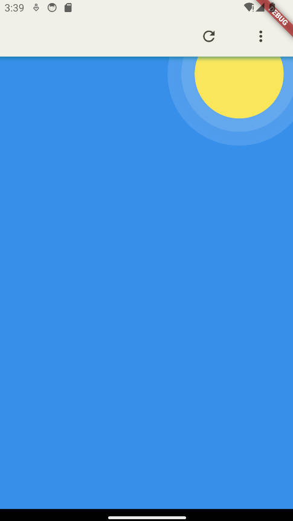
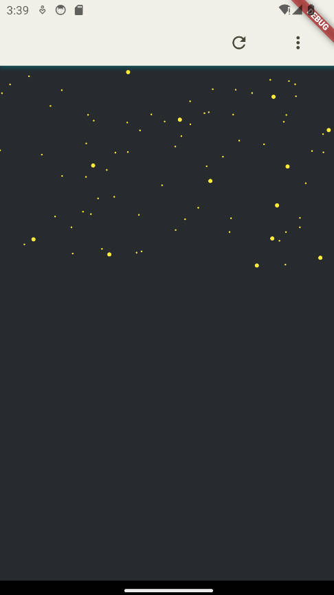
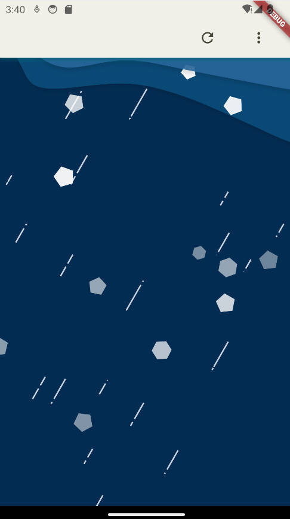

# nice_weather

全部采用Canvas绘制的天气效果，原设计来源于[站酷-天气不错](https://www.zcool.com.cn/work/ZMjMzMDE5MDQ=.html)。
由于没有拿到全部的UI设计，暂时只做了几个天气背景。其他效果有待补充。

> Video

 https://github.com/Dboy233/nice_weather/assets/37604230/417c792c-4a5f-4cb4-bf0f-7a42dd8caa5e
 
> Screen capture
|   |   |
| - | - |
|   | a |

